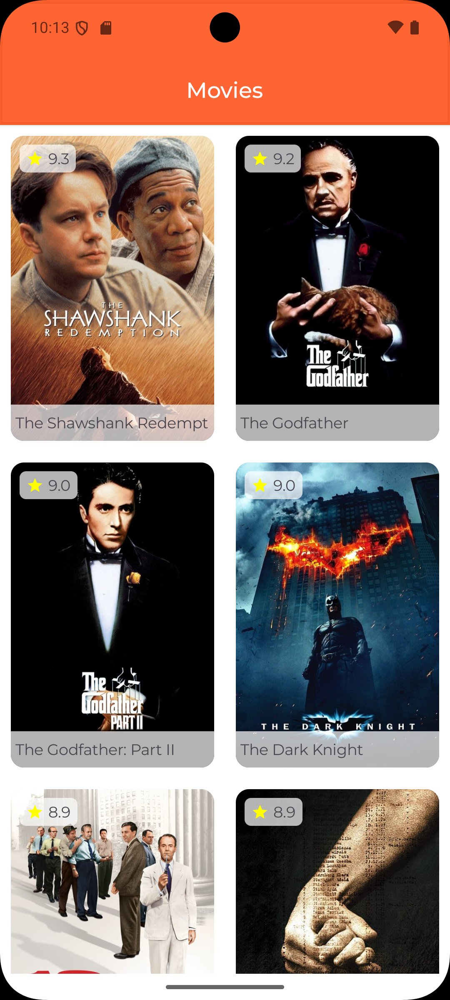
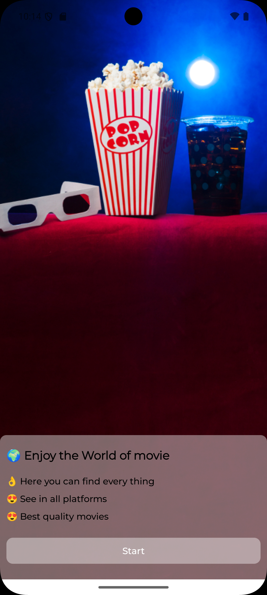
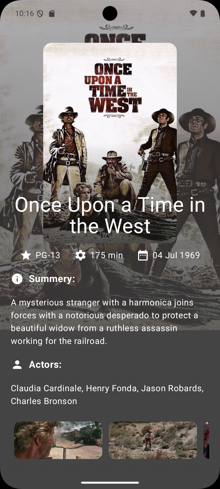

# 🎬 Movie MVVM Jetpack Compose App

A modern Android movie app built with **Jetpack Compose**, **MVVM Architecture**, **Retrofit** and **Pagination**.

## 🚀 Features

- Clean MVVM architecture
- Jetpack Compose UI
- Retrofit for networking
- Paging3 for infinite scrolling
- Kotlin Coroutines and Flow
- Material design theming
- Responsive and modern UI

## 📸 Screenshots

| Banner Screen | Home Screen | Detail Screen |
|---------------|-------------|---------------|
|  |  | 

## 📂 Project Structure

com.example.movie/
├── domain/ # Api interface
├── models/ # Data models (DTOs)
├── navigations/ # navigate
├── paging/ # manage pagination
├── ui/ # Composables and screens
├── utils/ # Utility classes
├── viewmodel/ # repo & viewModel
